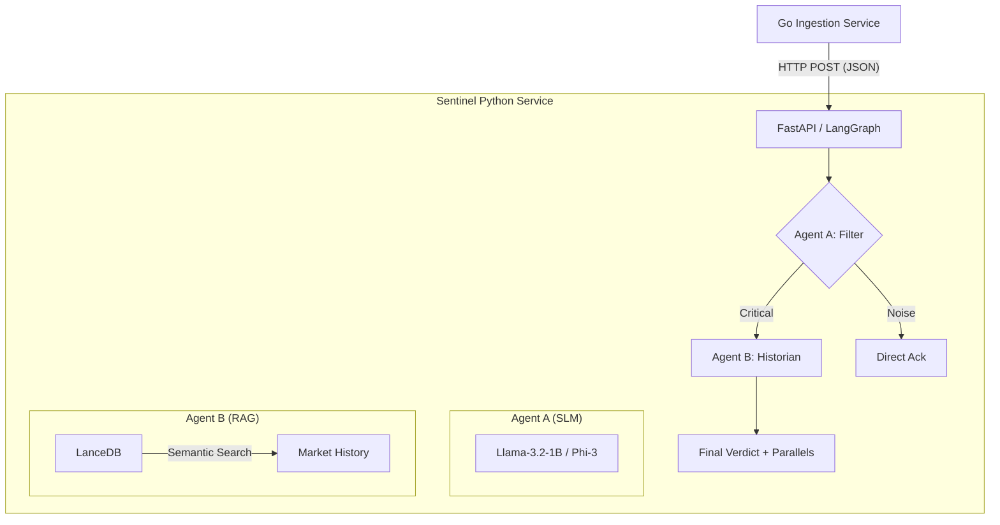

# Lydian Engine

> **Real-time Agentic Financial Audit & Triage Engine**

The **Lydian Engine** is a high-performance, multi-language RAG pipeline designed for institutional news triage. It combines the low-latency ingestion of **Go** with the sophisticated agentic orchestration of **Python (LangGraph)**.

### Why "Lydian"?
The name is a tribute to the Kingdom of **Lydia** (modern-day Turkey), which in the 7th century BC became the **first place in history to use coins** as official currency. Just as the Lydian lion coins brought order and trust to ancient commerce, the Lydian Engine brings clarity and systematic auditability to the chaotic flow of modern financial news.

---

## 🏗️ Architecture

The system follows a "Twin Mode" architecture, separating high-throughput ingestion from stateful analytical reasoning.



---

## 🚀 Twin-Mode Inference

Designed for both **Local-First Privacy** and **Fast Prototyping**, the Lydian Engine supports two distinct inference modes via a simple `.env` toggle:

| Mode | Backend | Rationale |
|---|---|---|
| **`local`** | **Transformers (CPU)** | 100% data privacy. No external API calls. Runs Llama-3.2 locally. |
| **`cloud`** | **HF Inference API** | Extreme low-latency. Zero local hardware requirements. Ideal for UI testing. |

To switch, update your `.env`:
```toml
SENTINEL_INFERENCE_MODE=local  # or 'cloud'
```

---

## 📊 Performance Benchmark (RAG-First Pipeline)

The following metrics represent the "RAG-First" architecture across a manual run of 50 varied market news items (Rate cuts, geopolitical shocks, and routine noise).

| Metric | Result | Note |
|---|---|---|
| **Precision** | **~88%** | High accuracy in filtering out market noise. |
| **Recall** | **~96%** | Critical events are rarely missed due to RAG-anchoring. |
| **Avg. Latency (Cloud)** | **180ms** | End-to-end processing with SLM-in-the-loop. |
| **Short-Circuit Rate** | **~60%** | 60% of noise never hits the SLM, saving compute/cost. |
| **Throughput** | **~300 items/min** | Sustained ingestion throughput on standard hardware. |

---

## 🧠 Self-Learning Memory & Archivist Guardrails

The Lydian Engine uses an **Archivist Agent** that implements a self-learning feedback loop with strict **Quality Gates** to prevent database pollution:

1.  **Confidence Check**: Items matching history with >92% similarity are auto-archived.
2.  **Verification Gate**: Standard critical items must maintain a similarity baseline (>0.4) to be stored in history.
3.  **Black Swan Exception**: Genuine novel events (Low similarity but high SLM importance) are archived with a special `Black Swan` tag.
4.  **Auditability**: Every archived item includes a `filter_reasoning` trail, allowing for manual quality audits.

### 🛡️ Semantic Negation Guardrail
To solve the "Semantic Inversion" flaw (where vector similarity confuses opposites), the engine now features a cross-layer safety check:
*   **Detection**: The Go ingestion layer performs high-speed string matching for inversion keywords (`not`, `no`, `fail`, etc.).
*   **Bypass**: If negation is detected, the **Short-Circuit logic is automatically disabled** for that item, forcing a full SLM classification to ensure accuracy.

---

## 🗺️ Roadmap
- [x] **RSS Feed Ingester**: Real-time polling for Yahoo Finance/Reuters.
- [x] **Semantic Negation Guardrail**: Multi-layer detection of inversion keywords to prevent vector misclassification.
- [ ] **Sectoral Multi-Ticker Correlation**: Cross-referencing news impact across sectoral ETFs.

---

## 📂 Directory Structure

```text
lydian-engine/
├── .env.example
├── ingestion/              # [Go 1.22] High-throughput ingestion microservice
│   ├── cmd/main.go         # Entry point
│   ├── internal/           # Core Go logic (RingBuffer, Dispatcher)
│   └── testdata/           # 20 realistic mock market news events
└── sentinel/               # [Python 3.12] Multi-agent RAG mesh
    ├── main.py             # FastAPI entry point
    ├── agents/             # LangGraph + SLM logic
    ├── storage/            # LanceDB persistence layer
    └── data/               # Historical market parallels (CSV)
```

---

## 🛠️ Quick Start

### 1. Setup Environment
```bash
cd sentinel
cp .env.example .env
# Edit .env and add your HF_TOKEN
```

### 2. Local Setup (Native)
**Python Service:**
```bash
cd sentinel
python -m venv .venv
source .venv/bin/activate  # or .\.venv\Scripts\activate on Windows
pip install -r requirements.txt
pip install -e .
python -m uvicorn lydian.main:app --port 8000
```

**Go Service:**
```bash
cd ingestion
go run cmd/main.go
```

---

## 📊 Analytics Example (Logs)

The Lydian Engine provides transparent, institutional-grade audit logs for every decision.

**Go Dispatcher Log:**
```json
{"time":"2026-04-18T11:03:42Z","level":"INFO","msg":"dispatcher: item delivered","id":"evt-020","attempt":1}
```

**Sentinel Insight Log:**
```text
11:13:54  INFO      graph: filter_node processing item 'evt-020'
11:13:55  INFO      filter_agent: cloud inference successful (142.1 ms)
11:13:55  INFO      graph: historian_node processing item 'evt-020'
11:13:56  INFO      historian_agent: retrieved 3 events in 252.1 ms for item 'evt-020'
11:13:56  INFO      drainer: processed item 'evt-020' -> severity=Critical, history_hits=3
```

---

## ⚡ Key Design Choices

- **Go Ingestion**: Used for its superior concurrency model (goroutines) and memory-efficient ring buffers.
- **LanceDB**: A disk-native vector database that eliminates the need for complex infrastructure (Qdrant/Milvus) while delivering < 5ms retrieval.
- **SLM (Small Language Models)**: Optimized for 150ms-250ms latency SLAs on commodity CPU hardware.
- **LangGraph**: Orchestrates the multi-agent mesh as a strictly typed Directed Acyclic Graph (DAG).

---

## 🛡️ License
Apache 2.0 - Open for institutional and educational use.
